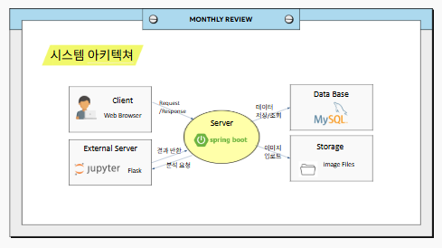
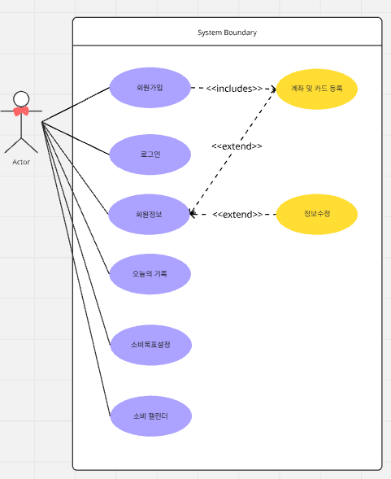
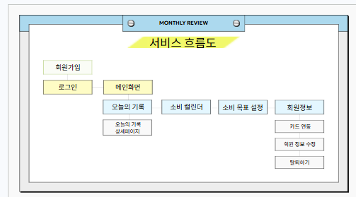
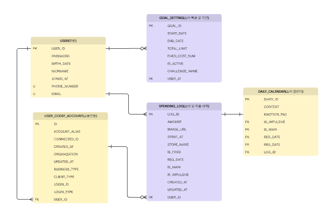

# 1. 🍙 주먹밥 (팀명: 3조)
> **"단순 지출 기록을 넘어, 소비 심리를 분석하고 케어하는 스마트 가계부"**

 

# 2. 👀 서비스 소개
* **서비스명:** 소비 심리 분석 기반 스마트 가계부 '주먹밥'
* **서비스 설명:** **CODEF API**를 통해 실시간 금융 데이터를 연동하고, 텍스트 마이닝 기술로 사용자의 지출을 '충동·보상·고정'으로 자동 분류합니다. 사용자의 소비 심리를 분석하여 맞춤형 가이드와 챌린지를 제공합니다.

 

# 3. 📅 프로젝트 기간
2026.03.10 ~ 2026.04.02 (완료)

 

# 4. ⭐ 주요 기능
* **금융 데이터 자동 연동:** CODEF API 기반 실시간 소비 내역 수집 및 자동 기록
* **AI 소비 심리 분석:** 자연어 처리(NLP) 기반 지출 원인(충동/보상/일반) 식별 및 분류
* **소비 목표 및 챌린지:** 개인별 예산 설정 및 실시간 소비 진행률 시각화 가이드
* **인터랙티브 대시보드:** 메인 페이지 상세 메뉴 오토 버튼 및 동적 UI 제공
* **통합 회원 관리:** 보안을 고려한 회원가입, 로그인 및 개인정보 수정 시스템

 

# 5. ⛏ 기술 스택
| 구분 | 내용 |
| :--- | :--- |
| **사용언어** |    |
| **프레임워크** |   |
| **DB / API** |   |
| **개발/실행환경** |    |

 

# 6. ⚙ 시스템 아키텍처

> Spring Boot 메인 서버와 Flask AI 서버 간의 이기종 통신 및 MySQL 데이터 흐름 설계

 

# 7. 📌 유스케이스

> 사용자 기반의 주요 기능(금융 연동, 심리 분석, 챌린지 관리) 정의

 

# 8. 🔄 서비스 흐름도

> CODEF API 데이터 수집부터 AI 분석 결과 시각화까지의 전체 프로세스

 

# 9. 🗄 ER 다이어그램

> 회원 정보, 지출 내역, 소비 심리 태그 등 데이터베이스 관계 구조

 

# 10. 👨‍👩‍👦‍👦 팀원 역할
| 배주형 (팀장) | 김수하 (팀원) | 문세희 (팀원) | 황세현 (팀원) |
| :---: | :---: | :---: | :---: |
| Backend / Fullstack | AI / Fullstack | Frontend | Backend / Fullstack |
| CODEF API 연동 및 관리 회원가입/로그인 서버 구축 카드 등록 페이지 구현 | 소비 패턴 분석 모델 개발 Flask 서버 구축 및 API 서빙 메인 페이지/소비 목표 구현 | 회원가입/로그인 UI 설계 소비 캘린더 화면 구현 회원 정보 수정 인터페이스 | 오늘의 기록 서버 구축 회원 정보 관리 API 개발 소비 캘린더 풀스택 구현 |

 

# 11. 🤾‍♂️ 트러블 슈팅
* **문제 1: 고정 지출 및 보상 소비 분류 오류**
  * **현상:** '월세' 같은 고정비나 '나를 위한 선물' 같은 보상 지출을 모델이 단순 '충동구매'로 오분류함.
  * **해결:** 모델 판단 이전에 고정비 키워드(`fixed_expenses`) 및 보상 키워드(`reward_keywords`)를 먼저 검사하는 **Rule-based 필터링 레이어**를 추가하여 정확도 개선.

* **문제 2: 이기종 언어(Java-Python) 간 시스템 통합 이슈**
  * **현상:** IntelliJ(Java) 환경에서 Python으로 구현된 AI 모델을 직접 호출하거나 데이터를 주고받는 데 어려움 발생.
  * **해결:** **Flask를 별도 서버로 구축**하고 **REST API(HTTP) 통신 방식**을 도입하여 서로 다른 언어 환경 간의 매끄러운 시스템 통합 성공.

* **문제 3: CODEF API 데이터 파싱 및 연동 지연**
  * **현상:** 외부 API로부터 넘어오는 방대한 금융 데이터 가공 및 서버 간 전달 과정에서의 처리 지연 발생.
  * **해결:** **DTO 설계 최적화** 및 비동기 파싱 로직을 적용하여 실시간 데이터 서빙 성능 확보.
